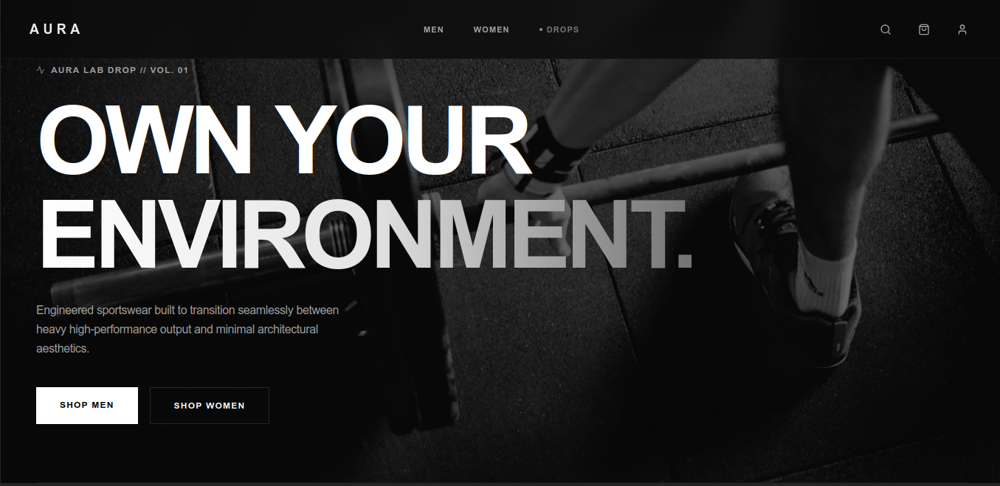
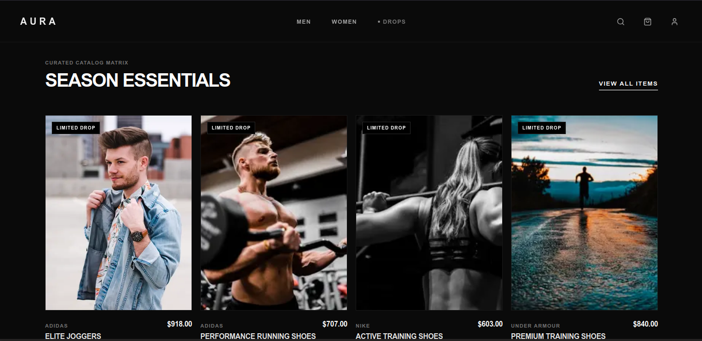
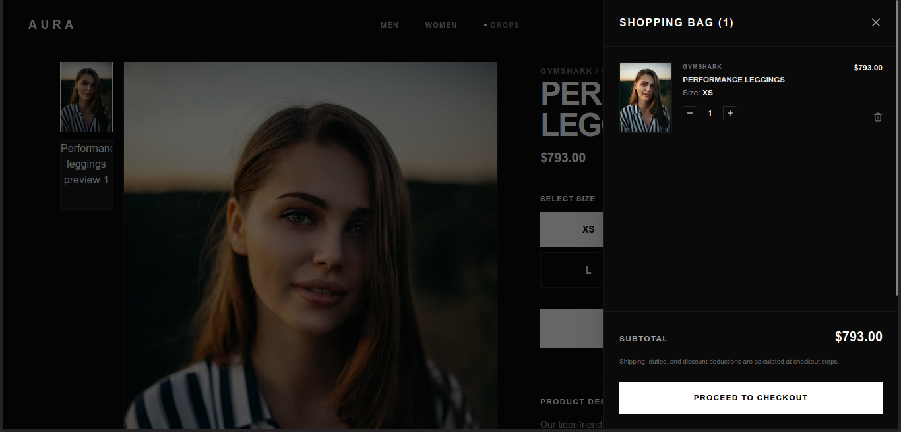
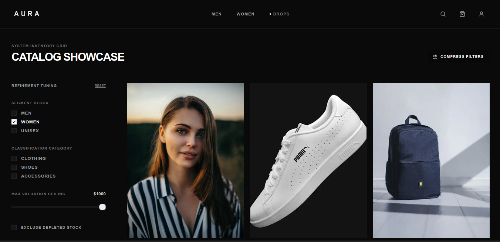
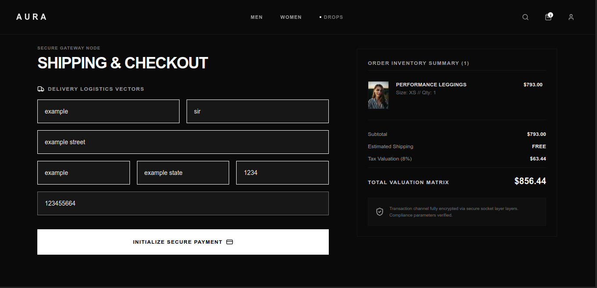
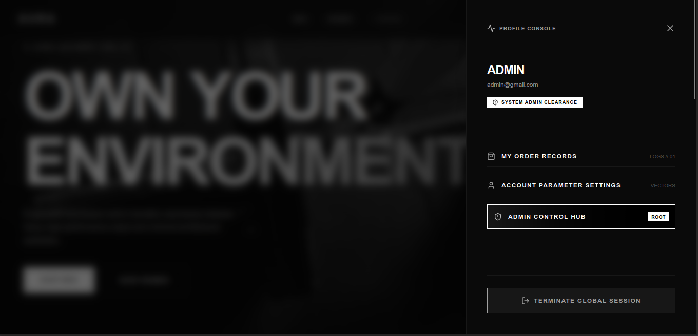
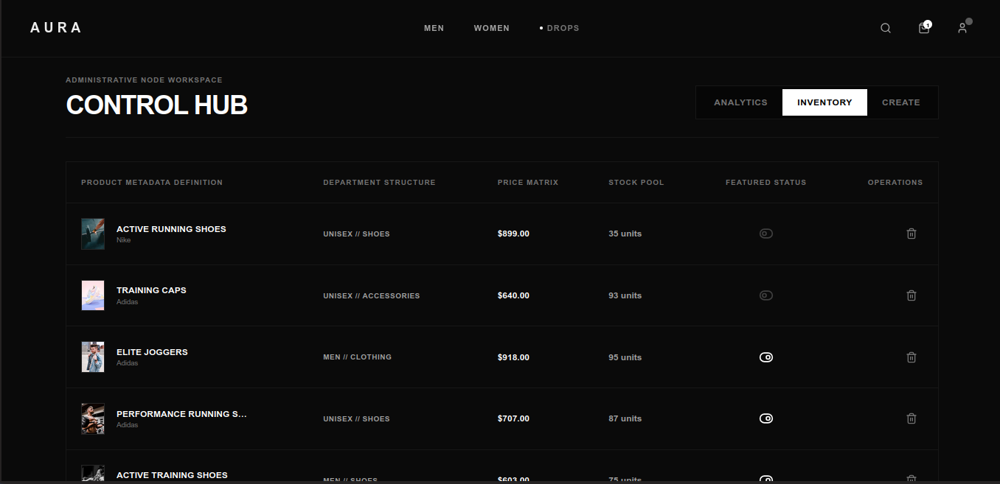
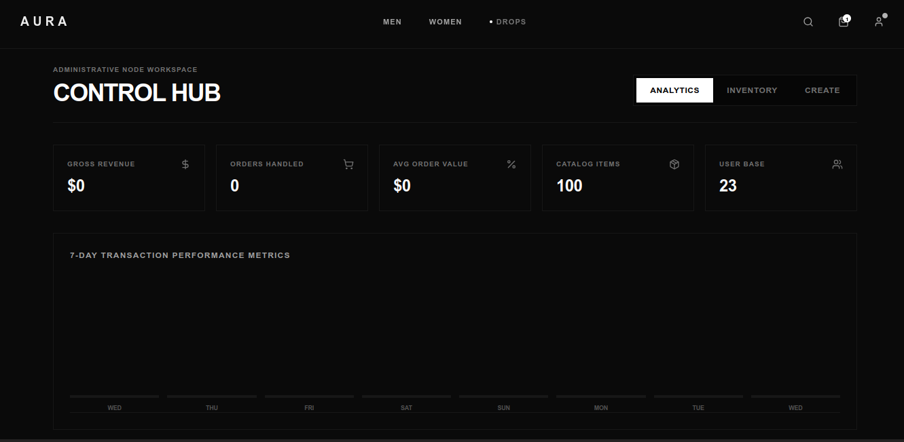
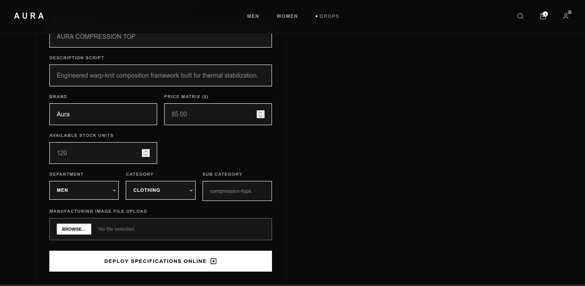

# A U R A // Premium E-Commerce Ecosystem

Aura is a high-end, production-ready full-stack e-commerce experience tailored for premium technical performance gear. Built with a stark, industrial minimalist design language inspired by luxury editorial frameworks (Zara, Nike Lab), the ecosystem features asynchronous layout scaling, real-time query parameter synchronization, and cryptographic payment fulfillment pipelines.

### Core Technology Vectors

<p align="left">
  <a href="https://nextjs.org"></a>
  <a href="https://tailwindcss.com"></a>
  <a href="https://www.framer.com/motion"></a>
  <a href="https://zustand-demo.pmnd.rs"></a>
  <a href="https://nodejs.org"></a>
  <a href="https://www.mongodb.com"></a>
  <a href="https://cloudinary.com"></a>
  <a href="https://razorpay.com"></a>
</p>

---

## 📦 Repository Structure

This project is split into separate frontend and backend repositories.

| Repository | Description |
| :--- | :--- |
| **Frontend (Current Repository)** | Next.js 15 storefront, admin dashboard, UI/UX, checkout flow, and client-side features. |
| **[Backend API](https://github.com/yash0g-dev/Aura-Ecom/tree/main/backend)** | Express.js REST API, authentication, MongoDB, Cloudinary, Razorpay integration, and admin services. |

> [!NOTE]  
> **Core Backend Inheritance:** The backend service powering this node ecosystem is inherited and refactored directly from the verified stable release of [Aura Backend v1 Core Architecture](https://github.com/yash0g-dev/Aura-Ecom/tree/main/backend).

## ⚡ Key Features

- **Modern Storefront Experience:** Premium, responsive UI with smooth animations, intuitive navigation, and a minimalist shopping experience optimized for desktop and mobile.

- **Dynamic Product Catalog:** Browse products with real-time filtering, sorting, and category refinement. Filter selections are synchronized with URL query parameters, making searches shareable and persistent across refreshes.

- **SEO-Friendly Product Pages:** Each product is accessible through clean, slug-based URLs, enabling better discoverability and a more intuitive browsing experience.

- **Secure Authentication:** Cookie-based authentication with protected admin routes and secure session management.

- **Razorpay Payment Integration:** End-to-end checkout flow powered by Razorpay with secure payment verification and order processing.

- **Administrative Dashboard:** Dedicated admin portal for managing the product catalog, inventory, orders, and store operations from a centralized interface.

- **Analytics & Telemetry:** Live dashboard displaying key business metrics, including revenue, orders, product performance, and overall store activity.

- **Cloud Media Management:** Product images are uploaded directly to Cloudinary for fast, reliable, and scalable media delivery.


<p align="center">
  
</p>

## 📸 Interface Showcase

### Client Discovery Catalog Shell

<p align="center">
  
    
    
    
</p>

---

## 🛠️ Architecture Matrix


### Tech Stack Details

| Layer | Technology | Primary Utility Function |
| :--- | :--- | :--- |
| **Frontend Frame** | `Next.js 15+ (App Router)` | Server-first layout generation, unified file-system routing. |
| **Style Canvas** | `Tailwind CSS` | Utility-first stark layout layouts, fluid layouts. |
| **Kinetic Layer** | `Framer Motion` | Hardware-accelerated width squeezing and full-bleed transitions. |
| **State Repository** | `Zustand` | Persistent lightweight memory array caching for asynchronous bag/cart tracking. |
| **Backend Engine** | `Node.js` / `Express` | Micro-route controllers, secure JSON Web Token authorization lines. |
| **Database Pool** | `MongoDB` / `Mongoose` | Rigid aggregation modeling and nested verification sub-documents. |
| **Media Delivery** | `Multer` / `Cloudinary` | Direct multi-part buffer asset streaming bypassing local disk layers. |
| **Payment Gateway**| `Razorpay SDK` | Cryptographic merchant handshake signatures and validation sandboxes. |

---

## 🎛️ Administrative Workspace Operations Guide

The ecosystem includes a secure, abstracted control vector for store managers to override inventory levels, parse financial velocity, and handle active product catalog drops. 

### 🔐 Root Verification Credentials
To access the administrative dashboard, pass the hardcoded root parameters through the secure authentication form:

* **Access Identity:** `admin@gmail.com`
* **Access Password:** `123456`

---

### 🕹️ Operational Walkthrough

#### Step 1: Accessing the Gateway Node
Navigate to the root authentication layout (`/login` ). Enter the verification credentials into the minimalist entry frame.

<p align="center">
  
   
</p>

---

#### Step 2: Telemetry Overview & Financial Tracking
Upon clean token signature verification, the node transitions to the telemetry board. Here you can monitor systemic gross merchandise value (GMV), capture totals, and transaction frequency logs.

<p align="center">
  
</p>


#### Step 3: Product Catalog Aggregation & Uploads
To append a new dropset item, navigate to the catalog manipulation sector. Use the native drag-and-drop boundary box to parse asset attachments straight to Cloudinary pipelines. Set strict string arrays for categories and tracking numbers.

<p align="center">
  
</p>


---

## 📋 System Configuration Variables

Create these localized profile documents inside the respective root directories to bind service nodes cleanly.

### Frontend Credentials (`/frontend/.env.local`)
```env
NEXT_PUBLIC_API_URL=http://localhost:5050
NEXT_PUBLIC_RAZORPAY_KEY_ID=rzp_test_YourPublicKeyHere
